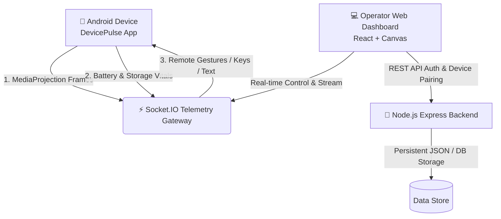

# 📱 DevicePulse — Remote Device Monitor & Fleet Control Platform

<div align="center">


**An open-source Android remote device administration, telemetry monitoring, and interactive screen control platform.**

[Disclaimer](#-legal--educational-disclaimer) • [Features](#-key-features) • [How to Run](#-how-to-run) • [APK Installation Guide](#-android-apk-installation-guide) • [Architecture](#-architecture) • [Default Credentials](#-default-credentials)

</div>

---

## ⚠️ Legal & Educational Disclaimer

> [!IMPORTANT]
> **FOR EDUCATIONAL, RESEARCH, AND AUTHORIZED DEVICE ADMINISTRATION PURPOSES ONLY.**
> 
> This software is developed solely as an educational demonstration of Android Accessibility APIs (`AccessibilityService`), MediaProjection screen capture, and bidirectional WebSocket communication.
> 
> - **Explicit Consent Required:** Installing or running this application on any device without the explicit, informed permission of the device owner is strictly prohibited.
> - **Zero Covert Surveillance:** This application does **NOT** operate covertly. It requires user interaction for permissions, displays persistent foreground service notifications, and complies with Android security guidelines.
> - **Author Disclaimer:** The developers and contributors assume no liability and are not responsible for any misuse or damage caused by this software. Users are solely responsible for ensuring compliance with all applicable local, national, and international laws.

---

## ✨ Key Features

### 🎮 Real-time Remote Screen Mirroring & Control
- **Low-Latency Screen Mirroring:** Streams live frames from Android devices via MediaProjection.
- **Interactive Web Remote Touch:** Tap, long-press, and swipe directly on the browser canvas to control the phone.
- **Hardware Keys & Global Actions:** Trigger `Back`, `Home`, `Recents`, `Notifications`, and `Lock Screen` from the browser.
- **Remote Text Typing:** Inject keyboard input into focused text fields on the mobile device.

### 📊 Live Telemetry & Vitals
- **Battery Health:** Real-time percentage, charging state, temperature, and voltage tracking.
- **Internal Storage:** Live breakdown of used, available, and total storage capacity.
- **Fleet Management:** Live online/offline heartbeat status with automatic reconnection.

### 🔒 Enterprise-Grade Security
- **Argon2id Hashing:** Industry-standard cryptographic password hashing.
- **Stateless Auth:** JWT Access Tokens with HTTP-only Refresh Token rotation.
- **Hardware Keystore:** Encrypted storage for device credentials on Android.
- **Secure Pairing:** Single-use 6-character pairing codes or QR code scanning.

---

## 🏗️ Architecture



---

## 🚀 How to Run

### Option 1: Quick Start with Docker (Recommended)

The easiest way to run the entire backend server and web dashboard is using Docker Compose:

```bash
# 1. Clone repository
git clone https://github.com/<your-username>/remote-device-monitor.git
cd remote-device-monitor

# 2. Build and launch all containers in background
docker compose up --build -d
```

**Access URLs:**
- 🌐 **Web Dashboard:** [http://localhost:5173](http://localhost:5173)
- 🔌 **Backend API:** [http://localhost:3000](http://localhost:3000)
- 🩺 **Health Check:** [http://localhost:3000/health](http://localhost:3000/health)

To stop the containers:
```bash
docker compose down
```

---

### Option 2: Local Development (Python Runner)

The project includes an automated runner script that handles dependencies, starts the backend & frontend, and generates public remote tunnels (ngrok / localtunnel) for cross-network connectivity:

```bash
python run.py
```

---

### Option 3: Manual Local Development

**1. Start Backend:**
```bash
cd backend
npm install
npm run dev
```

**2. Start Frontend:**
```bash
cd frontend
npm install
npm run dev
```

---

## 📱 Android APK Installation Guide

### 📍 APK File Location
The pre-compiled Android APK is located in this repository at:
```
android/app/build/outputs/apk/debug/app-debug.apk
```

---

### 📲 Step-by-Step Installation on Phone

#### Step 1: Transfer the APK to Your Phone
- Send `app-debug.apk` to your phone via USB cable, Google Drive, WhatsApp, or local download.

#### Step 2: Uninstall Any Previous Version (Important)
- If you previously had an earlier build of **DevicePulse** installed, **uninstall it first** to prevent Android signature conflict errors (`App not installed`).

#### Step 3: Install the APK & Handle Android Warnings
1. Open the `.apk` file using your phone's File Manager or Chrome.
2. If prompted with *"For your security, your phone is not allowed to install unknown apps from this source"*:
   - Tap **Settings** → toggle **"Allow from this source"** → tap **Back** → tap **Install**.
3. If Google Play Protect shows *"Blocked by Play Protect"* or *"Unsafe App"*:
   - Tap **"More details"** (or down arrow).
   - Tap **"Install anyway"**.
   *(Play Protect flags sideloaded APKs requesting accessibility and screen capture permissions).*

---

### ⚙️ First-Launch 5-Step Permission Setup

When you open **DevicePulse** on your phone for the first time, a guided 5-step onboarding flow will help you grant the required permissions:

1. **Runtime Permissions:** Camera (for QR code pairing) & Notifications (for persistent status).
2. **Battery Optimization Exemption:** Keeps background telemetry syncing when screen is off.
3. **Display Over Other Apps (Overlay):** Allows remote app launching from web console.
4. **Accessibility Service (DevicePulse Remote Control):**
   - Tap **Open Settings** → find **DevicePulse Remote Control** → toggle **ON** → tap **Allow**.
   - *(On Android 13/14: If greyed out, go to App Info → 3 dots top-right → "Allow restricted settings")*.
5. **Screen Capture (MediaProjection):** Tap **Start Now** when Android displays the screen capture security dialog.

---

### 🔗 Pairing Your Phone with the Web Dashboard

1. Open the Web Dashboard at [http://localhost:5173](http://localhost:5173) (or your public tunnel URL).
2. Log in with the default credentials or register an account.
3. Click **"Pair Device"** to generate a 6-character pairing code or QR code.
4. In the mobile app, tap **"Pair with Dashboard Code"**, enter the code, and tap **Verify & Pair**.
5. Your device will immediately appear on the web dashboard with live telemetry and screen mirror controls!

---

## 🔑 Default Credentials

The database comes pre-configured with a default operator account:

| Field | Value |
|---|---|
| **Email** | `admin@example.com` |
| **Password** | `Password@123` |

*(You can also use the **Auto-fill** button on the login screen or click **"Create operator account"** to register custom credentials).*

---

## 📡 API & WebSocket Specification

### REST Endpoints
| Method | Endpoint | Description |
|---|---|---|
| `POST` | `/api/auth/register` | Register new operator |
| `POST` | `/api/auth/login` | Sign in & obtain JWT tokens |
| `POST` | `/api/auth/refresh` | Rotate refresh token |
| `GET` | `/api/devices` | List registered devices & telemetry |
| `POST` | `/api/devices/pair` | Verify pairing code |
| `GET` | `/health` | Service health status |

### Socket.IO Real-time Events
| Event | Direction | Description |
|---|---|---|
| `device:register` | Device → Server | Handshake and device registration |
| `telemetry:update` | Device → Server → Web | Real-time battery and storage telemetry payload |
| `screen:frame` | Device → Server → Web | JPEG screen mirror frame buffer |
| `remote:input` | Web → Server → Device | Touch click, long-press, swipe, hardware key, or text input |

---

## 📄 License

Distributed under the **MIT License**. See [`LICENSE`](file:///d:/Claude%20Pro/Pro%203/remote-device-monitor/LICENSE) for details.
