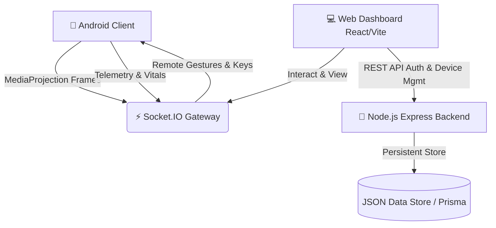

# 📱 DevicePulse — Remote Device Monitor & Fleet Control Platform

<div align="center">


**An enterprise-grade, privacy-first Android remote device monitoring and real-time screen control platform.**

[Features](#-key-features) • [Architecture](#-architecture) • [Quick Start (Docker)](#-quick-start-docker) • [Local Setup](#-local-development) • [Android App](#-android-client) • [Default Credentials](#-default-credentials)

</div>

---

## ✨ Key Features

### 🎮 Real-time Remote Screen Mirroring & Control
- **Low-Latency Screen Mirroring:** Streams screen frames in real-time from Android devices via MediaProjection.
- **Interactive Web Remote Touch:** Tap, long-press, and swipe directly on the browser canvas to control the mobile screen.
- **Hardware Keys & Global Actions:** Trigger `Back`, `Home`, `Recents`, `Notifications`, and `Lock Screen` from the browser.
- **Remote Text Typing:** Inject keyboard input into focused text fields on the mobile device.

### 📊 Live Telemetry & Vitals
- **Battery Health:** Live percentage, charging state, temperature, and voltage tracking.
- **Internal Storage:** Real-time breakdown of used, available, and total storage bytes.
- **Connection Status:** Real-time online/offline heartbeat with automatic reconnection.

### 🔒 Enterprise-Grade Security & Privacy
- **Password Hashing:** Argon2id algorithm for secure credential storage.
- **Stateless Authentication:** JWT Access Tokens with HTTP-only Refresh Token rotation.
- **Device Keystore:** Android Hardware Keystore encrypted credential storage.
- **Secure Pairing:** Single-use 6-character pairing codes or QR code scanning.
- **Zero Spyware Guarantee:** Strictly monitors device vitals and consented screen sessions — never accesses personal SMS, contacts, or call logs.

---

## 🏗️ Architecture



---

## 🚀 Quick Start (Docker)

The fastest way to get the full stack running is using Docker Compose:

### 1. Clone the repository
```bash
git clone https://github.com/your-username/remote-device-monitor.git
cd remote-device-monitor
```

### 2. Start services with Docker Compose
```bash
docker compose up --build -d
```

### 3. Access the Dashboard
- **Web Dashboard:** [http://localhost:5173](http://localhost:5173)
- **Backend API:** [http://localhost:3000](http://localhost:3000)
- **API Health Check:** [http://localhost:3000/health](http://localhost:3000/health)

To stop the containers:
```bash
docker compose down
```

---

## 💻 Local Development

If you prefer running without Docker:

### Prerequisites
- **Node.js**: v18+ or v20+
- **Python**: 3.8+ (for runner script)
- **Android Studio / SDK**: For building the mobile APK

### 1. Unified One-Command Runner
The project includes a Python runner (`run.py`) that installs dependencies, cleans ports, starts the backend & frontend, creates public tunnels (ngrok/localtunnel), and opens the browser:
```bash
python run.py
```

### 2. Manual Startup
**Backend:**
```bash
cd backend
npm install
npm run dev
```

**Frontend:**
```bash
cd frontend
npm install
npm run dev
```

---

## 📱 Android Client

### Building the APK
1. Open the `android/` directory in **Android Studio**.
2. Update the server URL in `android/app/build.gradle` (or tap the connection banner in the app):
   ```groovy
   buildConfigField "String", "SERVER_BASE_URL", "\"http://YOUR_COMPUTER_IP:3000\""
   buildConfigField "String", "SOCKET_URL",      "\"http://YOUR_COMPUTER_IP:3000\""
   ```
3. Build the APK: **Build > Build Bundle(s) / APK(s) > Build APK(s)**
4. Or compile via Gradle:
   ```bash
   cd android
   ./gradlew assembleDebug
   ```
   *The built APK will be located at `android/app/build/outputs/apk/debug/app-debug.apk`.*

### Sideloading & Permissions
1. Install the APK on your Android phone.
2. Complete the **5-step First-Launch Onboarding**:
   - Runtime Permissions (Notifications, Camera, Storage)
   - Battery Optimization Exemption
   - Overlay (Draw Over Other Apps)
   - Accessibility Service (**DevicePulse Remote Control**)
   - MediaProjection (Screen Sharing)

---

## 🔑 Default Credentials

The initial database comes pre-seeded with a default operator account:

| Field | Value |
|---|---|
| **Email** | `admin@example.com` |
| **Password** | `Password@123` |

*(You can also use the **Auto-fill** button on the login screen or click **"Create operator account"** to register your own).*

---

## 📡 API & WebSocket Specification

### REST Endpoints
| Method | Endpoint | Description |
|---|---|---|
| `POST` | `/api/auth/register` | Register new operator |
| `POST` | `/api/auth/login` | Sign in & obtain JWT tokens |
| `POST` | `/api/auth/refresh` | Rotate refresh token |
| `GET` | `/api/devices` | List registered devices & telemetry |
| `POST` | `/api/devices/pair` | Verify pairing code |
| `GET` | `/health` | Service health status |

### Socket.IO Events
| Event | Direction | Description |
|---|---|---|
| `device:register` | Device → Server | Handshake and device registration |
| `telemetry:update` | Device → Server → Web | Battery and storage telemetry update |
| `screen:frame` | Device → Server → Web | JPEG screen mirror frame payload |
| `remote:input` | Web → Server → Device | Touch click, swipe, keypress, or text input |

---

## 📄 License

Distributed under the **MIT License**. See `LICENSE` for details.
